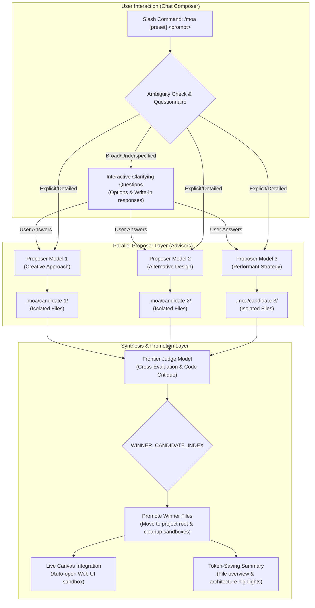

# 📦 @goodandready/dsh-moa

<div align="center">

<h3>Mixture of Agents (MoA) Multi-Model Collaboration & Synthesis Engine for DeepSeek Harness</h3>

<p align="center">
  <a href="https://www.npmjs.com/package/@goodandready/dsh-moa"></a>
  <a href="LICENSE"></a>
  <a href="https://github.com/topics/dsh-plugin"></a>
  <a href="https://nodejs.org"></a>
</p>

<p align="center">
  <a href="https://goodandready.app/"></a>
</p>

<p align="center">
  <a href="README.md"><b>🇬🇧 English</b></a> •
  <a href="docs/README.ru.md"><b>🇷🇺 Русский</b></a> •
  <a href="docs/README.zh.md"><b>🇨🇳 中文说明</b></a>
</p>

</div>

---

## ⚡ Overview & The Problem

Single-model AI generation often suffers from blind spots, single-perspective biases, hallucinated architectural choices, and inconsistent code quality on challenging engineering tasks. When prompted with ambiguous or complex specifications, a single model may make premature assumptions and produce monolithic, unvetted implementations.

**`@goodandready/dsh-moa`** brings the **Mixture of Agents (MoA)** architecture natively to DeepSeek Harness via the `/moa` slash command:

1. **Adaptive Clarification Questionnaire**: For broad or underspecified prompts, advisor models formulate clarifying options and the judge synthesizes a structured 2–4 question questionnaire before generating code.
2. **Parallel Proposers Fan-Out & Workspace Isolation**: Multiple independent models evaluate the prompt concurrently. Each candidate's proposed files are written to isolated disk sandboxes (`.moa/candidate-N/`), avoiding cross-pollution.
3. **Frontier Judge Evaluation & File Promotion**: A flagship reasoning model critically benchmarks all proposals, selects the winning candidate via machine markers (`WINNER_CANDIDATE_INDEX: N`), and promotes the winner's files directly into the project root directory.
4. **Instant Live Canvas Previewing**: When web applications or UI components are generated, `dsh-moa` integrates seamlessly with `@goodandready/dsh-live-canvas`, automatically spawning sandboxes for 1-click browser previewing.
5. **Token-Saving Chat Summarization**: Replaces massive code dumps in chat bubbles with compact file listings and clean architectural summaries.
6. **One-Shot Session Model Restoration**: Executes cleanly as a one-shot turn modifier, automatically reverting back to the user's primary session model immediately after completion.
7. **Dynamic Model Pricing Catalog & Token Estimation**: Real-time rate resolution for 300+ models fetched automatically in the background from OpenRouter's public catalog (cached locally in `~/.dsh/storages/dsh-moa-catalog.json` for 24h), plus support for direct vendor rates and custom `prices` overrides in `settings.yaml`.
8. **Refinement Mode (Incremental Edits)**: Automatically detects existing codebase context to generate precise delta modifications instead of destructive full-file rewrites.
9. **Fast Mode & Custom Judge Criteria**: Ultra-fast single-model preset for quick tasks and customizable evaluation guidelines for the judge.
10. **Run History & Win-Rate Leaderboard**: Persistent logging with built-in REST endpoints (`/dsh-moa/history` and `/dsh-moa/leaderboard`).

---

## 🏗️ Architecture



---

## ✨ Features & Capabilities

### 1. Slash Command (`/moa`) & Autocompletion
Integrated directly into the DeepSeek Harness composer via client input triggers. Typing `/moa` shows presets and instant autocompletion:

```text
/moa build a real-time reactive dashboard with charts and websocket updates
```

Or target a specific named preset:

```text
/moa:code-review audit the auth middleware and security boundaries
```

### 2. Adaptive Questionnaire Gate
When prompts are open-ended or lack architectural specifications (e.g. *"build a calculator app"*), advisor models detect ambiguities and formulate focused clarifying questions (e.g., UI style, persistence backend, framework choice) before generating code.

### 3. Parallel Fan-Out with Live Heartbeats
* Proposers query concurrently with live heartbeat progress badges (`⏳ [3s] Processing...`, per-model completion status).
* Bulky system prompts and tool schemas are cleanly stripped from advisor contexts, eliminating "missing tools" refusals and token bloat.

### 4. Disk-Level Candidate Isolation & Promotion
Unlike standard chat-only MoA, `dsh-moa` isolates file generation onto the filesystem:
* Each proposer generates files into `.moa/candidate-1/`, `.moa/candidate-2/`, etc.
* The Judge compares implementations and selects the optimal solution with `WINNER_CANDIDATE_INDEX: N`.
* The winner's files are promoted to the workspace root, and temporary candidate directories are pruned automatically.

### 5. Live Canvas 1-Click Preview
If web files (`index.html`, React/JSX components, Vue, CSS) are generated, `dsh-moa` communicates with `@goodandready/dsh-live-canvas` via its REST endpoint to instantiate a live preview container with 1-click instant access.

### 6. Native Settings Card & Presets
Configure your models in `Settings → Plugins → Mixture of Agents`:
* Set custom Proposer models (e.g., fast generative models for diverse ideas).
* Set the Aggregator / Judge model (e.g., deep reasoning models for rigorous critique).
* Configure named presets (`default`, `code-review`, `deep-reasoning`).

---

## 📦 Installation

Install into your DeepSeek Harness web profile:

```bash
dsh plugin --profile web add @goodandready/dsh-moa
```

Restart your DeepSeek Harness instance and refresh the browser.

---

## ⚙️ Configuration (`settings.yaml`)

Configure presets and model pipelines in `settings.yaml` or through the Web UI Settings panel:

```yaml
# settings.yaml
dsh-moa:
  defaultPreset: "default"
  presets:
    default:
      references:
        - provider: "your-fast-provider"
          model: "your-creative-model"
        - provider: "your-fast-provider"
          model: "your-balanced-model"
      aggregator:
        provider: "your-reasoning-provider"
        model: "your-judge-model"
  prices:
    "my-provider/my-model":
      input: 0.20
      output: 0.80
    "ollama/*":
      input: 0
      output: 0
    code-review:
      references:
        - provider: "your-fast-provider"
          model: "your-security-model"
        - provider: "your-fast-provider"
          model: "your-performance-model"
      aggregator:
        provider: "your-reasoning-provider"
        model: "your-judge-model"
```

### Configuration Parameters

| Parameter | Type | Default | Description |
|:---|:---|:---|:---|
| `defaultPreset` | `string` | `"default"` | Default preset invoked when typing `/moa <prompt>` |
| `presets.<name>.references` | `array` | `[...]` | List of proposer models queried concurrently during the proposal phase |
| `presets.<name>.aggregator` | `object` | `{...}` | Frontier judge model responsible for synthesis, critique, and winner selection |
| `enableQuestionnaire` | `boolean` | `true` | Enable interactive clarifying questionnaire for underspecified requests |
| `autoPromoteWinner` | `boolean` | `true` | Automatically promote the judge's selected winner files into the project workspace |

---

## 📊 REST API & Endpoints

| Endpoint | Method | Description |
|:---|:---|:---|
| `/dsh-moa/presets` | `GET` | Returns list of configured MoA presets |
| `/dsh-moa/history?limit=20&offset=0` | `GET` | Returns recent MoA runs with candidates, winner, cost, and tokens |
| `/dsh-moa/leaderboard` | `GET` | Computes model win-rate leaderboard and average execution costs |

---

## 🧪 Testing

Run the automated test suite:

```bash
npm test
```

---

## 📄 License

MIT © [GooDAnDReaDY](https://github.com/GooDAnDReaDY)
