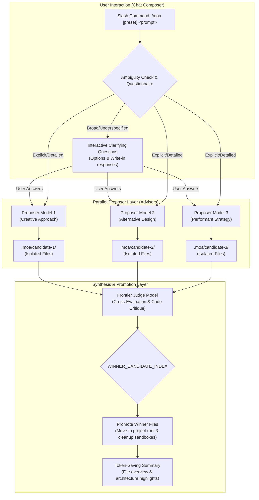

# 📦 @goodandready/dsh-moa

<div align="center">

<h3>Mixture of Agents (MoA) Multi-Model Collaboration & Synthesis Engine for DeepSeek Harness</h3>

<p align="center">
  <a href="https://www.npmjs.com/package/@goodandready/dsh-moa"></a>
  <a href="LICENSE"></a>
  <a href="https://github.com/topics/dsh-plugin"></a>
  <a href="https://nodejs.org"></a>
</p>

<p align="center">
  <a href="https://goodandready.app/"></a>
</p>

<p align="center">
  <a href="README.md"><b>🇬🇧 English</b></a> •
  <a href="README.ru.md"><b>🇷🇺 Русский</b></a> •
  <a href="README.zh.md"><b>🇨🇳 中文说明</b></a>
</p>

<table align="center">
  <tr>
    <td align="center">
      ⭐ <strong>If you like this plugin, please star it on GitHub</strong> — it shows me that the plugin is useful to you and motivates me to keep developing it.
      <br><br>
      🐛 <strong>If you find a bug or would like to request a feature</strong>, open a GitHub issue in any language — I will review your proposal and implement useful suggestions in a future plugin version.
    </td>
  </tr>
</table>

</div>

---

## ⚡ Overview & The Problem

Single-model AI generation often suffers from blind spots, single-perspective biases, hallucinated architectural choices, and inconsistent code quality on challenging engineering tasks. When prompted with ambiguous or complex specifications, a single model may make premature assumptions and produce monolithic, unvetted implementations.

**`@goodandready/dsh-moa`** brings the **Mixture of Agents (MoA)** architecture natively to DeepSeek Harness via the `/moa` slash command:

1. **Adaptive Clarification Questionnaire**: For broad or underspecified prompts, advisor models formulate clarifying options and the judge synthesizes a structured 2–4 question questionnaire before generating code.
2. **Parallel Proposers Fan-Out & Workspace Isolation**: Multiple independent models evaluate the prompt concurrently. Each candidate's proposed files are written to isolated disk sandboxes (`.moa/candidate-N/`), avoiding cross-pollution.
3. **Frontier Judge Evaluation & File Promotion**: A flagship reasoning model critically benchmarks all proposals, selects the winning candidate via machine markers (`WINNER_CANDIDATE_INDEX: N`), and promotes the winner's files directly into the project root directory.
4. **Token-Saving Chat Summarization**: Replaces massive code dumps in chat bubbles with compact file listings and clean architectural summaries.
5. **One-Shot Session Model Restoration**: Executes cleanly as a one-shot turn modifier, automatically reverting back to the user's primary session model immediately after completion.
6. **Dynamic Model Pricing Catalog & Token Estimation**: Real-time rate resolution for 300+ models fetched automatically in the background from OpenRouter's public catalog (cached locally in `~/.dsh/storages/dsh-moa-catalog.json` for 24h), plus support for direct vendor rates and custom `prices` overrides in `settings.yaml`.
7. **Refinement Mode (Incremental Edits)**: Automatically detects existing codebase context to generate precise delta modifications instead of destructive full-file rewrites.
8. **Fast Mode & Custom Judge Criteria**: Ultra-fast single-model preset for quick tasks and customizable evaluation guidelines for the judge.
9. **Run History & Win-Rate Leaderboard**: Persistent logging of every run kind (synthesis, fast mode, questionnaire) with built-in REST endpoints (`/dsh-moa/history`, `/dsh-moa/leaderboard`, `/dsh-moa/runs/<id>`).
10. **Live Canvas 1-Click Preview (optional)**: when the `@goodandready/dsh-live-canvas` plugin is installed in the same profile, the promoted HTML is pushed to its sandbox and the MoA answer carries a one-click preview link; without it the step is skipped silently.

---

## 🏗️ Architecture



---

## ✨ Features & Capabilities

### 1. Slash Command (`/moa`) & Autocompletion
Integrated directly into the DeepSeek Harness composer via client input triggers. Typing `/moa` shows presets and instant autocompletion:

```text
/moa build a real-time reactive dashboard with charts and websocket updates
```

Or target a specific named preset:

```text
/moa code-review audit the auth middleware and security boundaries
```

The flag form is equivalent:

```text
/moa --preset=deep-reasoning solve this math problem step by step
```

### 2. Adaptive Questionnaire Gate
When prompts are open-ended or lack architectural specifications (e.g. *"build a calculator app"*), advisor models detect ambiguities and formulate focused clarifying questions (e.g., UI style, persistence backend, framework choice) before generating code.

### 3. Parallel Fan-Out with Live Heartbeats
* Proposers query concurrently with live heartbeat progress badges (`⏳ [3s] Processing...`, per-model completion status).
* Bulky system prompts and tool schemas are cleanly stripped from advisor contexts, eliminating "missing tools" refusals and token bloat.

### 4. Disk-Level Candidate Isolation & Promotion
Unlike standard chat-only MoA, `dsh-moa` isolates file generation onto the filesystem:
* Each proposer generates files into `.moa/candidate-1/`, `.moa/candidate-2/`, etc.
* The Judge compares implementations and selects the optimal solution with `WINNER_CANDIDATE_INDEX: N`.
* The winner's files are promoted to the workspace root, and temporary candidate directories are pruned automatically.

### 5. Native Settings Card & Presets
Configure your models in `Settings → Plugins → Mixture of Agents`:
* Set custom Proposer models (e.g., fast generative models for diverse ideas).
* Set the Aggregator / Judge model (e.g., deep reasoning models for rigorous critique).
* Configure named presets (`default`, `fast`, `deep-reasoning`), judge criteria and temperatures.
* Enable or disable MoA and see the real host status chip; the telemetry grid shows total runs and average run cost.

### 7. Candidate Diff Viewer
Inspect line-by-line differences between candidate proposals and the curator's synthesized deliverable directly in the UI. Features file selection, delta line highlights (added, removed, same), and unified diff rendering via a zero-dependency in-memory LCS algorithm.

### 8. Pre-Promotion Git Checkpoints (`dsh-time-machine`)
Before promoting any winning candidate files over the workspace root, `dsh-moa` invokes the local `dsh-time-machine` service to create a shadow Git checkpoint (`moa-pre-promotion: candidate-N`). If `dsh-time-machine` is absent or unreachable, file promotion proceeds seamlessly via best-effort fallback.

### 6. Live Canvas 1-Click Preview (optional)
If `@goodandready/dsh-live-canvas` is installed in the same profile, `dsh-moa` pushes the promoted HTML file to the Live Canvas REST contract (`POST /dsh-live-canvas/api/preview`, served by the same harness webServer) and appends a one-click preview link (`/dsh-live-canvas/sandbox/<id>`) to the answer. Without the plugin the step is skipped silently — no errors in the log, no dead links.

---

## 📦 Installation

Install into your DeepSeek Harness web profile:

```bash
dsh plugin --profile web add @goodandready/dsh-moa
```

Restart your DeepSeek Harness instance and refresh the browser.

---

## ⚡ 10 Specialized Built-in Presets & Candidate Personas

v0.2.13 introduces 10 ready-to-use presets engineered for real-world software workflows:

| Preset Name | Purpose | Default Aggregator | Peer Critique | Blind Eval |
| :--- | :--- | :--- | :---: | :---: |
| `default` | Balanced multi-model generation | `codex:gpt-5.6-sol` | Optional | Off |
| `code-review` | Thorough peer review & vulnerability detection | `codex:gpt-5.6-sol` | On | On |
| `fast-audit` | Ultra-fast single-model audit (Fast Mode) | `codex:gpt-5.6-sol` | Off | Off |
| `deep-architect` | Distributed systems & complex architectures | `codex:gpt-5.6-sol` | On | Off |
| `bug-hunter` | Root cause discovery & adversarial edge cases | `codex:gpt-5.6-sol` | On | Off |
| `refactor-cleanup` | Dead-code pruning & standard-library simplicity | `codex:gpt-5.6-sol` | Off | Off |
| `frontend-ui` | High-fidelity responsive web interfaces | `codex:gpt-5.6-sol` | Off | Off |
| `security-audit` | Zero-trust threat analysis & sanitization | `codex:gpt-5.6-sol` | On | On |
| `math-logic` | Deterministic algorithmic proofs & math logic | `codex:gpt-5.6-sol` | On | Off |
| `creative-brainstorm`| Divergent lateral thinking & ideation | `codex:gpt-5.6-sol` | Off | Off |

### Candidate Personas (`role_persona`)
Assign archetypal engineering mentalities to individual candidate slots to ensure genuine perspective divergence:
- **`minimalist` (Ponytail Senior)**: standard library first, zero external dependencies, minimal moving parts.
- **`robustness`**: defensive coding, boundary validation, graceful fallback handling, idempotent operations.
- **`performance`**: algorithmic complexity minimization, memory efficiency, zero-copy operations.
- **`tester`**: test-driven methodology, high branch coverage, explicit assertion design.
- **`general`**: balanced standard engineering approach.

---

## 🤝 Consilium Round 2 (Peer Critique) & Syntax Auto-Fix Gate

- **Consilium (Round 2)**: Enable `peer_critique_enabled: true` in preset settings. Each candidate receives peer proposals and submits an improved, hardened iteration before judge evaluation.
- **Syntax Pre-Check Gate**: In-memory JS/MJS and JSON syntax verification runs automatically on all candidate files. If a proposal contains syntax errors, it is flagged with `[⚠️ Syntax Warning]` and the judge receives a strict mandate: *if this candidate has superior design, auto-correct the syntax in the synthesized deliverable and award them the win*.
- **User Candidate Override**: Enable `allow_candidate_override: true` to preserve candidate sandboxes in `.moa/candidate-N/`. At any time, promote any candidate using `/moa promote <runId> <candidateIndex>` or the UI button.

---

## ⚙️ Configuration (`settings.yaml`)


Configure presets and model pipelines in `settings.yaml` or through the Web UI Settings panel (Settings → Plugins → Mixture of Agents):

```yaml
# settings.yaml
dsh-moa:
  enabled: true
  default_preset: "default"
  prices:
    "my-provider/my-model":
      input: 0.20
      output: 0.80
    "ollama/*":
      input: 0
      output: 0
  presets:
    - name: default
      ask_clarifying_questions: true
      reference_models:
        - provider: "your-fast-provider"
          model: "your-creative-model"
        - provider: "your-fast-provider"
          model: "your-balanced-model"
      aggregator:
        provider: "your-reasoning-provider"
        model: "your-judge-model"
      reference_temperature: 0.6
      aggregator_temperature: 0.4
      max_tokens: 4096
      judge_criteria: ""
    - name: fast
      ask_clarifying_questions: false
      reference_models:
        - provider: "your-fast-provider"
          model: "your-fast-model"
      aggregator:
        provider: "your-fast-provider"
        model: "your-fast-model"
```

### Configuration Parameters

| Parameter | Type | Default | Description |
|:---|:---|:---|:---|
| `enabled` | `boolean` | `true` | Master switch for the `/moa` command, turn routing and `POST /dsh-moa/run` (editable in the settings card) |
| `default_preset` | `string` | `"default"` | Preset invoked when typing `/moa <prompt>` without an explicit preset |
| `presets` | `array` | `[...]` | Named presets; selected via `/moa <name> <prompt>` or `/moa --preset=<name> <prompt>` |
| `presets[].reference_models` | `array` | `[...]` | Proposer models queried concurrently during the proposal phase |
| `presets[].aggregator` | `object` | `{...}` | Judge model responsible for synthesis, critique, and winner selection |
| `presets[].ask_clarifying_questions` | `boolean` | `true` | Synthesize a clarifying questionnaire for broad/underspecified prompts (per preset) |
| `presets[].curator_synthesis` | `boolean` | `false` | Curator mode: evaluates strongest parts across candidates using the antipatterns rubric and advises an assembler model |
| `presets[].stream_aggregator` | `boolean` | `true` | Stream judge/aggregator tokens live in real-time with zero TTFT wait |
| `presets[].quorum_enabled` | `boolean` | `false` | Straggler mitigation: proceed with synthesis once >= 60% candidates respond |
| `presets[].grace_period_sec` | `number` | `10` | Grace period in seconds to wait for stragglers after quorum is reached |
| `presets[].aggregator_fallbacks` | `array` | `[]` | Ordered fallback judge models tried if primary aggregator encounters transient errors |
| `presets[].blind_evaluation` | `boolean` | `false` | Anonymize candidate model names for the judge/curator to eliminate family/brand bias |
| `presets[].reference_timeout_sec` | `number` | `60` | Per-candidate execution timeout in seconds |
| `presets[].aggregator_timeout_sec` | `number` | `180` | Aggregator/judge synthesis timeout in seconds |
| `presets[].reference_temperature` / `.aggregator_temperature` | `number` | `0.6` / `0.4` | Sampling temperatures for proposers and judge |
| `presets[].max_tokens` | `number` | `4096` | Max output tokens per model call |
| `presets[].judge_criteria` | `string` | `""` | Optional extra evaluation criteria passed to the judge |
| `prices` | `map` | `{}` | Custom USD-per-1M-token rates (`"provider/model"`, `"provider/*"`, `"*"`) applied to cost estimation |

> **Privacy note:** in refinement mode, readable project files (up to ~16k characters; dotfiles such as `.env*` are excluded) are included in the prompts sent to the configured candidate and judge providers. Avoid running `/moa` in projects whose non-dotfile files contain secrets.

---

## 📊 REST API & Endpoints

| Endpoint | Method | Description |
|:---|:---|:---|
| `/dsh-moa/status` | `GET` | Health/enablement snapshot used by the settings card status chip |
| `/dsh-moa/presets` | `GET` | Returns the configured MoA presets and default preset |
| `/dsh-moa/presets` | `POST` | Replaces presets/default preset/enabled after schema validation (400 on invalid payload) |
| `/dsh-moa/models` | `GET` | Lists models available for candidate/judge slots |
| `/dsh-moa/history?limit=20&offset=0` | `GET` | Returns recent MoA runs with candidates, winner, cost, and tokens |
| `/dsh-moa/leaderboard` | `GET` | Computes model win-rate leaderboard and average execution costs |
| `/dsh-moa/runs/<id>` | `GET` | Returns a single recorded run by id |
| `/dsh-moa/run` | `POST` | Runs the full MoA pipeline over HTTP (400 when `enabled: false`) |
| `/dsh-moa/diff` | `GET` | Computes line-by-line diff between candidate runs or curator synthesis |
| `/dsh-moa/promote` | `POST` | Manually promotes candidate workspace files to project root |
| `/api/dsh-moa/update` | `POST` | One-click plugin updater from npm with safe-write verification |

---

## 🧪 Testing

Run the automated test suite:

```bash
npm test
```

---


## 🛠️ Internal Tooling & Development

For local verification and package integrity validation:
- `npm test`: runs the full test suite (95 tests)
- `./deploy.sh`: local infrastructure validation script (verifies package size, identity parity in package.json/cordis.patch.yml/client.js, and tests). Excluded from the published npm package.

## 📄 License

MIT © [GooDAnDReaDY](https://github.com/GooDAnDReaDY)
