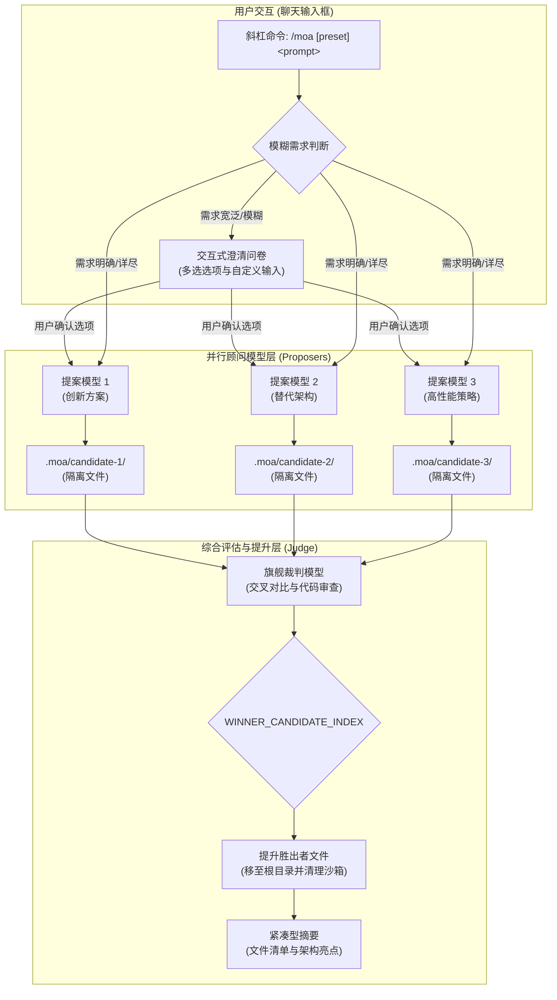

# 📦 @goodandready/dsh-moa

<div align="center">

<h3>面向 DeepSeek Harness 的 Mixture of Agents (MoA) 多模型协作与代码综合引擎</h3>

<p align="center">
  <a href="https://www.npmjs.com/package/@goodandready/dsh-moa"></a>
  <a href="../LICENSE"></a>
  <a href="https://github.com/topics/dsh-plugin"></a>
  <a href="https://nodejs.org"></a>
</p>

<p align="center">
  <a href="https://goodandready.app/"></a>
</p>

<p align="center">
  <a href="README.md"><b>🇬🇧 English</b></a> •
  <a href="README.ru.md"><b>🇷🇺 Русский</b></a> •
  <a href="README.zh.md"><b>🇨🇳 中文说明</b></a>
</p>

<table align="center">
  <tr>
    <td align="center">
      ⭐ <strong>如果您喜欢这个插件，请在 GitHub 上为它点亮 Star</strong> — 这能让我知道插件对您有用，并鼓励我继续开发和维护它。
      <br><br>
      🐛 <strong>如果您发现 Bug 或希望增加功能</strong>，请使用任意语言在 GitHub 上提交 Issue — 我会评估您的建议，并在后续版本中实现有价值的改进。
    </td>
  </tr>
</table>

</div>

---

## ⚡ 概述与解决的核心痛点

在面对复杂的软件工程任务时，单一模型生成往往容易受到视角盲区、架构幻觉以及生成质量不稳定的限制。当用户输入模糊或缺乏技术细节的提示词时，单一模型容易做出主观假设，生成未经充分验证的单体代码。

**`@goodandready/dsh-moa`** 通过 `/moa` 斜杠命令将 **Mixture of Agents (MoA)** 混合智能体架构原生引入 DeepSeek Harness：

1. **自适应澄清问卷 (Questionnaire Gate)**：针对宽泛或不明确的提示词，顾问模型（Proposers）自动提炼关键分歧点，裁判模型（Judge）在生成代码前合成结构化的 2–4 题交互式问卷。
2. **多模型并行生成与工作区沙箱隔离**：多个独立模型并行分析任务。每个候选方案的文件生成均写入独立的磁盘沙箱 (`.moa/candidate-N/`)，彻底避免跨模型文件污染。
3. **旗舰裁判模型评估与文件自动提升 (Promotion)**：深度推理模型对所有候选方案进行交叉评审，通过机器标记 (`WINNER_CANDIDATE_INDEX: N`) 评选胜出方案，并将胜出者的完整文件自动同步到项目根目录。
4. **极简对话摘要与 Token 节省**：对话界面不输出冗长的原始代码块，而是生成整洁的文件清单与架构设计摘要。
5. **单轮会话即时恢复**：作为一次性会话修改器运行，任务完成后自动恢复用户原本的会话主力模型。
6. **动态定价目录与 Token 成本估算**：300+ 模型的实时价格自动从 OpenRouter 公开目录后台获取（无需鉴权，缓存于 `~/.dsh/storages/dsh-moa-catalog.json`，24 小时刷新），同时支持直连厂商价格与 `settings.yaml` 中的自定义 `prices` 覆盖。
7. **增量修改模式 (Refinement Mode)**：自动感知现有代码库上下文，生成精确的增量修改而非破坏性的整文件重写。
8. **快速模式与自定义评审标准**：面向快速任务的单模型极简管线，以及可自定义的裁判评审准则。
9. **运行历史与胜率排行榜**：对每一类运行（综合、快速模式、问卷）进行持久化记录，并内置 REST 端点（`/dsh-moa/history`、`/dsh-moa/leaderboard`、`/dsh-moa/runs/<id>`）。
10. **Live Canvas 一键预览（可选）**：当同一 profile 中安装了 `@goodandready/dsh-live-canvas` 时，提升到项目根目录的 HTML 会被推入其沙箱，MoA 回答附带一键预览链接；未安装时该步骤静默跳过。

---

## 🏗️ 架构图



---

## ✨ 特性与能力

### 1. 斜杠命令 (`/moa`) 与实时补全
深度集成于 DeepSeek Harness 输入框。输入 `/moa` 即可触发预设菜单与自动补全：

```text
/moa 开发一个包含图表与 WebSocket 实时更新的响应式仪表盘
```

或指定命名预设：

```text
/moa code-review 审查身份验证中间件和安全边界
```

等效的 flag 形式：

```text
/moa --preset=deep-reasoning 逐步求解这道数学题
```

### 2. 自适应澄清问卷
当需求过于抽象（例如 *"制作一个计算器"*）时，系统会在生成代码前主动询问 UI 风格、数据持久化方式或框架偏好。

### 3. 并行调用与实时心跳反馈
* 多个顾问模型并发执行，并伴随实时心跳进度条 (`⏳ [3s] Processing...`，显示各模型独立进度)。
* 自动清理顾问上下文中的冗余系统提示词与工具定义，消除“缺少工具”的拒绝报错并大幅节约 Token。

### 4. 磁盘级沙箱隔离与胜出者提升
与仅停留在聊天文本层面的 MoA 不同，`dsh-moa` 针对真实工程项目：
* 各提案模型在 `.moa/candidate-1/`、`.moa/candidate-2/` 等独立目录生成工程代码。
* 裁判模型对比各版本实现，通过 `WINNER_CANDIDATE_INDEX: N` 指定最优方案。
* 胜出方案自动提升至项目根目录，临时沙箱随后自动清理。

### 5. 原生设置卡片与预设管理
在 `设置 → 插件 → Mixture of Agents` 中可视化配置模型：
* 配置顾问模型列表（快速生成多样化构想）。
* 配置裁判模型（强推理模型进行严谨审查）。
* 自定义命名预设 (`default`, `fast`, `deep-reasoning`)、裁判评审准则与温度。
* 启用/停用 MoA 开关并查看真实的主机状态徽章；遥测网格展示总运行次数与平均运行成本。

### 6. Live Canvas 一键预览（可选）
若同一 profile 中安装了 `@goodandready/dsh-live-canvas`，`dsh-moa` 会将提升后的 HTML 文件推送到 Live Canvas 的 REST 契约（`POST /dsh-live-canvas/api/preview`，由同一 harness webServer 提供服务），并在回答中附上一键预览链接（`/dsh-live-canvas/sandbox/<id>`）。未安装该插件时此步骤静默跳过——日志无报错，也不会出现死链接。

---

## 📦 安装

在 DeepSeek Harness Web 配置文件中安装：

```bash
dsh plugin --profile web add @goodandready/dsh-moa
```

重启 DeepSeek Harness 实例并刷新浏览器页面。

---

## ⚙️ 配置 (`settings.yaml`)

可在 `settings.yaml` 中配置预设与模型管道，或通过 Web UI 设置面板（设置 → 插件 → Mixture of Agents）进行调整：

```yaml
# settings.yaml
dsh-moa:
  enabled: true
  default_preset: "default"
  prices:
    "my-provider/my-model":
      input: 0.20
      output: 0.80
    "ollama/*":
      input: 0
      output: 0
  presets:
    - name: default
      ask_clarifying_questions: true
      reference_models:
        - provider: "your-fast-provider"
          model: "your-creative-model"
        - provider: "your-fast-provider"
          model: "your-balanced-model"
      aggregator:
        provider: "your-reasoning-provider"
        model: "your-judge-model"
      reference_temperature: 0.6
      aggregator_temperature: 0.4
      max_tokens: 4096
      judge_criteria: ""
    - name: fast
      ask_clarifying_questions: false
      reference_models:
        - provider: "your-fast-provider"
          model: "your-fast-model"
      aggregator:
        provider: "your-fast-provider"
        model: "your-fast-model"
```

### 配置项说明

| 参数 | 类型 | 默认值 | 说明 |
|:---|:---|:---|:---|
| `enabled` | `boolean` | `true` | `/moa` 命令、回合路由与 `POST /dsh-moa/run` 的总开关（可在设置卡片中切换） |
| `default_preset` | `string` | `"default"` | 输入 `/moa <prompt>` 且未显式指定预设时调用的预设 |
| `presets` | `array` | `[...]` | 命名预设列表；通过 `/moa <name> <prompt>` 或 `/moa --preset=<name> <prompt>` 选择 |
| `presets[].reference_models` | `array` | `[...]` | 并行提案阶段并发调用的顾问模型列表 |
| `presets[].aggregator` | `object` | `{...}` | 负责综合评审、代码审查与裁决胜出者的裁判模型 |
| `presets[].ask_clarifying_questions` | `boolean` | `true` | 针对宽泛需求合成澄清问卷（预设级别开关） |
| `presets[].reference_temperature` / `.aggregator_temperature` | `number` | `0.6` / `0.4` | 顾问与裁判的采样温度 |
| `presets[].max_tokens` | `number` | `4096` | 每次模型调用的最大输出 Token 数 |
| `presets[].judge_criteria` | `string` | `""` | 传给裁判的可选附加评审准则 |
| `prices` | `map` | `{}` | 自定义美元/百万 Token 费率（`"provider/model"`、`"provider/*"`、`"*"`），用于成本估算 |

> **隐私提示：** 在增量修改模式下，可读的项目文件（最多约 1.6 万字符；`.env*` 等点文件已被排除）会随提示词发送给所配置的候选模型与裁判模型。请勿在非点文件中包含密钥的项目里运行 `/moa`。

---

## 📊 REST API 端点

| 端点 | 方法 | 说明 |
|:---|:---|:---|
| `/dsh-moa/status` | `GET` | 供设置卡片状态徽章使用的健康/启用状态快照 |
| `/dsh-moa/presets` | `GET` | 返回已配置的 MoA 预设与默认预设 |
| `/dsh-moa/presets` | `POST` | 经 schema 校验后替换预设/默认预设/enabled（非法载荷返回 400） |
| `/dsh-moa/models` | `GET` | 列出可用于候选/裁判槽位的模型 |
| `/dsh-moa/history?limit=20&offset=0` | `GET` | 返回近期运行记录（含候选、胜出者、Token 与成本） |
| `/dsh-moa/leaderboard` | `GET` | 计算模型胜率排行榜与平均执行成本 |
| `/dsh-moa/runs/<id>` | `GET` | 按 id 返回单条运行记录 |
| `/dsh-moa/run` | `POST` | 通过 HTTP 运行完整 MoA 管线（`enabled: false` 时返回 400） |

---

## 🧪 测试

运行自动化测试套件：

```bash
npm test
```

---

## 📄 许可证

MIT © [GooDAnDReaDY](https://github.com/GooDAnDReaDY)
