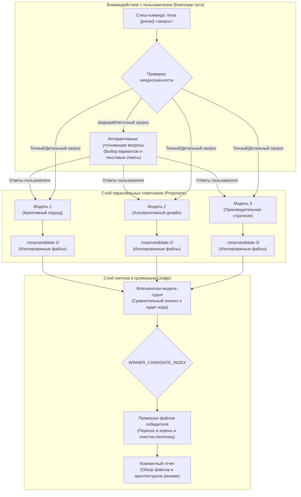

# 📦 @goodandready/dsh-moa

<div align="center">

<h3>Движок мультимодельного взаимодействия и синтеза Mixture of Agents (MoA) для DeepSeek Harness</h3>

<p align="center">
  <a href="https://www.npmjs.com/package/@goodandready/dsh-moa"></a>
  <a href="../LICENSE"></a>
  <a href="https://github.com/topics/dsh-plugin"></a>
  <a href="https://nodejs.org"></a>
</p>

<p align="center">
  <a href="https://goodandready.app/"></a>
</p>

<p align="center">
  <a href="../README.md"><b>🇬🇧 English</b></a> •
  <a href="README.ru.md"><b>🇷🇺 Русский</b></a> •
  <a href="README.zh.md"><b>🇨🇳 中文说明</b></a>
</p>

</div>

---

## ⚡ Обзор и решаемая проблема

Генерация кода и архитектурных решений силами одной модели часто страдает от слепых зон, предвзятости одного подхода, галлюцинаций в структуре проекта и нестабильного качества на сложных инженерных задачах. При работе с неоднозначными требованиями одиночная модель нередко делает поспешные предположения и выдает монолитный, непроверенный результат.

**`@goodandready/dsh-moa`** интегрирует архитектуру **Mixture of Agents (MoA)** прямо в DeepSeek Harness через слеш-команду `/moa`:

1. **Адаптивный опросник для уточнения требований**: Если запрос пользователя сформулирован слишком широко или не содержит ключевых деталей, модели-советники формируют уточняющие варианты, а модель-судья синтезирует структурированный интерактивный опросник (2–4 вопроса) до начала генерации кода.
2. **Параллельный опрос моделей (Proposers) и изоляция на диске**: Несколько независимых моделей анализируют задачу одновременно. Файлы каждого кандидата сохраняются в изолированные директории (`.moa/candidate-N/`), исключая конфликты.
3. **Оценка флагманским судьей (Judge) и автоматический промоушн файлов**: Модель глубоких рассуждений проводит критический сравнительный анализ всех предложенных решений, выбирает победителя с помощью машинного маркера (`WINNER_CANDIDATE_INDEX: N`) и переносит готовые файлы победителя напрямую в корень проекта.
4. **Экономия токенов в чате**: Вместо вывода огромных листингов кода в чат формируется компактный отчет с перечнем созданных файлов и архитектурным резюме.
5. **Одноразовый модификатор сессии**: Команда выполняется в рамках одного такта и автоматически возвращает исходную модель сессии пользователя сразу после завершения.
6. **Динамический каталог тарифов и подсчет токенов**: Актуальные цены на 300+ моделей автоматически подтягиваются из публичного каталога OpenRouter (без ключей и авторизации), кешируются в `~/.dsh/storages/dsh-moa-catalog.json` на 24 часа, а также поддерживают прямые вендорские тарифы и пользовательские оверрайды `prices` в `settings.yaml`.
7. **Режим доработки (Refinement Mode)**: Автоматически считывает контекст существующего проекта и генерирует точечные дельта-правки без перетирания всей кодовой базы.
8. **Быстрый режим (Fast Mode) и критерии судьи**: Режим для одиночных быстрых задач без судьи и гибкая настройка фокуса оценки (безопасность, производительность, минимализм).
9. **История запусков и лидерборд моделей**: Персистентное логирование всех видов запусков (синтез, fast mode, опросник) и REST-эндпоинты (`/dsh-moa/history`, `/dsh-moa/leaderboard`, `/dsh-moa/runs/<id>`).
10. **Live Canvas 1-клик предпросмотр (опционально)**: если в профиле установлен `@goodandready/dsh-live-canvas`, промоученный HTML отправляется в его песочницу, а ответ MoA содержит ссылку на предпросмотр в 1 клик; без плагина шаг тихо пропускается.

---

## 🏗️ Архитектура



---

## ✨ Возможности и функциональность

### 1. Слеш-команда (`/moa`) и автодополнение
Плагин интегрируется напрямую в композер DeepSeek Harness. Ввод `/moa` открывает всплывающее меню с готовыми пресетами и автодополнением:

```text
/moa разработай реактивный дашборд с графиками и обновлениями по websocket
```

Или вызов именованного пресета:

```text
/moa code-review проведи аудит middleware авторизации и границ безопасности
```

Эквивалентная форма с флагом:

```text
/moa --preset=deep-reasoning реши эту математическую задачу по шагам
```

### 2. Адаптивный гейт уточнения требований
Когда запрос сформулирован слишком обобщенно (например, *"сделай калькулятор"*), советники определяют недостающие архитектурные требования и формулируют целевые вопросы (стиль интерфейса, сохранение состояния, стек технологий) до генерации кода.

### 3. Параллельный запуск с живыми пульсами прогресса
* Советники опрашиваются параллельно со статусами выполнения в реальном времени (`⏳ [3s] Processing...`, индивидуальный прогресс каждой модели).
* Из контекстов советников удаляются громоздкие системные промпты и схемы инструментов, что предотвращает ошибки отказа из-за отсутствия инструментов и экономит контекст.

### 4. Файловая изоляция кандидатов и промоушн
В отличие от обычных чатовых реализаций MoA, `dsh-moa` работает с реальной файловой системой:
* Каждый советник генерирует файлы в изолированные папки `.moa/candidate-1/`, `.moa/candidate-2/` и т.д.
* Судья сопоставляет реализации и выбирает лучшую через маркер `WINNER_CANDIDATE_INDEX: N`.
* Файлы победителя автоматически переносятся в корень рабочей области, а временные папки удаляются.

### 5. Нативная карточка настроек и пресеты
Настройка моделей в меню `Настройки → Плагины → Mixture of Agents`:
* Выбор моделей-советников (быстрые генеративные модели для разнообразия идей).
* Выбор модели-судьи (модель глубоких рассуждений для строгого аудита).
* Конфигурация именованных пресетов (`default`, `fast`, `deep-reasoning`), критериев судьи и температур.
* Включение/отключение MoA и фактический статус-бейдж хоста; сетка телеметрии показывает общее число запусков и среднюю стоимость.

### 6. Live Canvas 1-клик предпросмотр (опционально)
Если в профиле установлен `@goodandready/dsh-live-canvas`, `dsh-moa` отправляет промоученный HTML-файл в REST-контракт Live Canvas (`POST /dsh-live-canvas/api/preview`, тот же webServer харнесса) и добавляет к ответу ссылку на предпросмотр (`/dsh-live-canvas/sandbox/<id>`). Без плагина шаг пропускается тихо — без ошибок в журнале и без битых ссылок.

---

## 📦 Установка

Установка в веб-профиль DeepSeek Harness:

```bash
dsh plugin --profile web add @goodandready/dsh-moa
```

Перезапустите экземпляр DeepSeek Harness и обновите вкладку в браузере.

---

## ⚙️ Конфигурация (`settings.yaml`)

Настройка пресетов и пайплайнов моделей доступна в `settings.yaml` или через интерфейс (Настройки → Плагины → Mixture of Agents):

```yaml
# settings.yaml
dsh-moa:
  enabled: true
  default_preset: "default"
  prices:
    "my-provider/my-model":
      input: 0.20
      output: 0.80
    "ollama/*":
      input: 0
      output: 0
  presets:
    - name: default
      ask_clarifying_questions: true
      reference_models:
        - provider: "your-fast-provider"
          model: "your-creative-model"
        - provider: "your-fast-provider"
          model: "your-balanced-model"
      aggregator:
        provider: "your-reasoning-provider"
        model: "your-judge-model"
      reference_temperature: 0.6
      aggregator_temperature: 0.4
      max_tokens: 4096
      judge_criteria: ""
    - name: fast
      ask_clarifying_questions: false
      reference_models:
        - provider: "your-fast-provider"
          model: "your-fast-model"
      aggregator:
        provider: "your-fast-provider"
        model: "your-fast-model"
```

### Параметры конфигурации

| Параметр | Тип | По умолчанию | Описание |
|:---|:---|:---|:---|
| `enabled` | `boolean` | `true` | Главный выключатель команды `/moa`, маршрутизации тактов и `POST /dsh-moa/run` (редактируется в карточке настроек) |
| `default_preset` | `string` | `"default"` | Пресет по умолчанию, вызываемый командой `/moa <запрос>` без явного пресета |
| `presets` | `array` | `[...]` | Именованные пресеты; выбираются через `/moa <имя> <запрос>` или `/moa --preset=<имя> <запрос>` |
| `presets[].reference_models` | `array` | `[...]` | Список моделей-советников, опрашиваемых параллельно |
| `presets[].aggregator` | `object` | `{...}` | Модель-судья, отвечающая за синтез, критику и выбор победителя |
| `presets[].ask_clarifying_questions` | `boolean` | `true` | Синтез опросника для широких/неоднозначных запросов (на уровне пресета) |
| `presets[].reference_temperature` / `.aggregator_temperature` | `number` | `0.6` / `0.4` | Температуры сэмплирования советников и судьи |
| `presets[].max_tokens` | `number` | `4096` | Максимум выходных токенов на вызов модели |
| `presets[].judge_criteria` | `string` | `""` | Опциональные дополнительные критерии оценки для судьи |
| `prices` | `map` | `{}` | Пользовательские тарифы USD за 1M токенов (`"provider/model"`, `"provider/*"`, `"*"`) для расчета стоимости |

> **Примечание о приватности:** в режиме доработки читаемые файлы проекта (до ~16 тыс. символов; dotfile-файлы вида `.env*` исключены) включаются в промпты, отправляемые настроенным моделям-кандидатам и судье. Не запускайте `/moa` в проектах, где не-dotfile файлы содержат секреты.

---

## 📊 REST API эндпоинты

| Эндпоинт | Метод | Описание |
|:---|:---|:---|
| `/dsh-moa/status` | `GET` | Снимок здоровья/включенности для статус-бейджа карточки настроек |
| `/dsh-moa/presets` | `GET` | Возвращает настроенные пресеты MoA и пресет по умолчанию |
| `/dsh-moa/presets` | `POST` | Заменяет пресеты/пресет по умолчанию/enabled после валидации схемой (400 при невалидном payload) |
| `/dsh-moa/models` | `GET` | Список моделей, доступных для слотов кандидатов и судьи |
| `/dsh-moa/history?limit=20&offset=0` | `GET` | История запусков с кандидатами, победителем, токенами и ценой |
| `/dsh-moa/leaderboard` | `GET` | Лидерборд побед моделей и средняя стоимость генерации |
| `/dsh-moa/runs/<id>` | `GET` | Возвращает один записанный запуск по id |
| `/dsh-moa/run` | `POST` | Запускает полный пайплайн MoA по HTTP (400 при `enabled: false`) |

---

## 🧪 Тестирование

Запуск автоматического набора тестов:

```bash
npm test
```

---

## 📄 Лицензия

MIT © [GooDAnDReaDY](https://github.com/GooDAnDReaDY)
