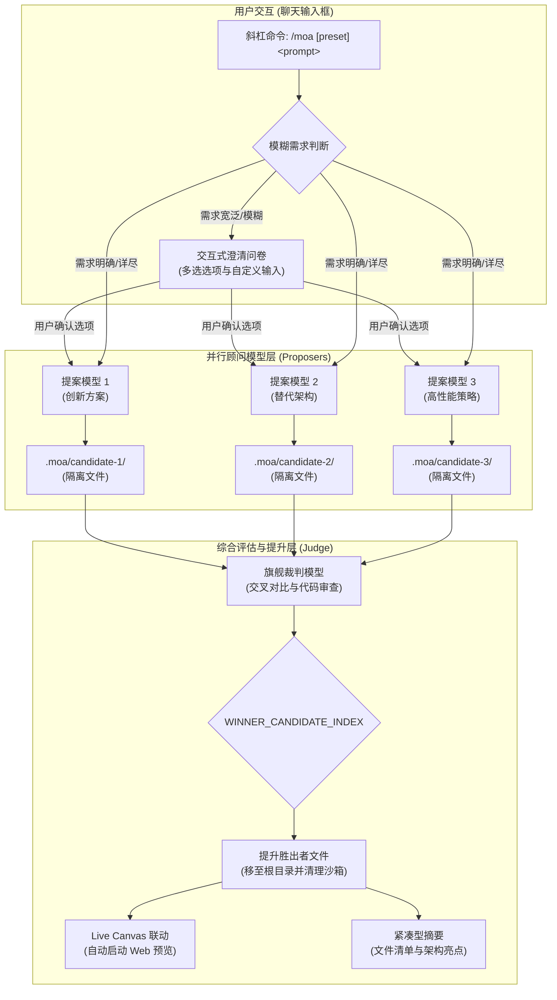

# 📦 @goodandready/dsh-moa

<div align="center">

<h3>面向 DeepSeek Harness 的 Mixture of Agents (MoA) 多模型协作与代码综合引擎</h3>

<p align="center">
  <a href="https://www.npmjs.com/package/@goodandready/dsh-moa"></a>
  <a href="../LICENSE"></a>
  <a href="https://github.com/topics/dsh-plugin"></a>
  <a href="https://nodejs.org"></a>
</p>

<p align="center">
  <a href="https://goodandready.app/"></a>
</p>

<p align="center">
  <a href="../README.md"><b>🇬🇧 English</b></a> •
  <a href="README.ru.md"><b>🇷🇺 Русский</b></a> •
  <a href="README.zh.md"><b>🇨🇳 中文说明</b></a>
</p>

</div>

---

## ⚡ 概述与解决的核心痛点

在面对复杂的软件工程任务时，单一模型生成往往容易受到视角盲区、架构幻觉以及生成质量不稳定的限制。当用户输入模糊或缺乏技术细节的提示词时，单一模型容易做出主观假设，生成未经充分验证的单体代码。

**`@goodandready/dsh-moa`** 通过 `/moa` 斜杠命令将 **Mixture of Agents (MoA)** 混合智能体架构原生引入 DeepSeek Harness：

1. **自适应澄清问卷 (Questionnaire Gate)**：针对宽泛或不明确的提示词，顾问模型（Proposers）自动提炼关键分歧点，裁判模型（Judge）在生成代码前合成结构化的 2–4 题交互式问卷。
2. **多模型并行生成与工作区沙箱隔离**：多个独立模型并行分析任务。每个候选方案的文件生成均写入独立的磁盘沙箱 (`.moa/candidate-N/`)，彻底避免跨模型文件污染。
3. **旗舰裁判模型评估与文件自动提升 (Promotion)**：深度推理模型对所有候选方案进行交叉评审，通过机器标记 (`WINNER_CANDIDATE_INDEX: N`) 评选胜出方案，并将胜出者的完整文件自动同步到项目根目录。
4. **Live Canvas 即时一键预览**：当生成 Web 应用或 UI 组件时，`dsh-moa` 与 `@goodandready/dsh-live-canvas` 深度联动，自动创建沙箱容器，支持在浏览器中 1 键即时运行与交互。
5. **极简对话摘要与 Token 节省**：对话界面不输出冗长的原始代码块，而是生成整洁的文件清单与架构设计摘要。
6. **单轮会话即时恢复**：作为一次性会话修改器运行，任务完成后自动恢复用户原本的会话主力模型。

---

## 🏗️ 架构图



---

## ✨ 特性与能力

### 1. 斜杠命令 (`/moa`) 与实时补全
深度集成于 DeepSeek Harness 输入框。输入 `/moa` 即可触发预设菜单与自动补全：

```text
/moa 开发一个包含图表与 WebSocket 实时更新的响应式仪表盘
```

或指定命名预设：

```text
/moa:code-review 审查身份验证中间件和安全边界
```

### 2. 自适应澄清问卷
当需求过于抽象（例如 *"制作一个计算器"*）时，系统会在生成代码前主动询问 UI 风格、数据持久化方式或框架偏好。

### 3. 并行调用与实时心跳反馈
* 多个顾问模型并发执行，并伴随实时心跳进度条 (`⏳ [3s] Processing...`，显示各模型独立进度)。
* 自动清理顾问上下文中的冗余系统提示词与工具定义，消除“缺少工具”的拒绝报错并大幅节约 Token。

### 4. 磁盘级沙箱隔离与胜出者提升
与仅停留在聊天文本层面的 MoA 不同，`dsh-moa` 针对真实工程项目：
* 各提案模型在 `.moa/candidate-1/`、`.moa/candidate-2/` 等独立目录生成工程代码。
* 裁判模型对比各版本实现，通过 `WINNER_CANDIDATE_INDEX: N` 指定最优方案。
* 胜出方案自动提升至项目根目录，临时沙箱随后自动清理。

### 5. Live Canvas 1 键即时预览
若生成了前端文件（`index.html`、React/JSX 组件、Vue、CSS），插件通过 REST API 自动调用 `@goodandready/dsh-live-canvas` 容器，实现免构建一键预览。

### 6. 原生设置卡片与预设管理
在 `设置 → 插件 → Mixture of Agents` 中可视化配置模型：
* 配置顾问模型列表（快速生成多样化构想）。
* 配置裁判模型（强推理模型进行严谨审查）。
* 自定义命名预设 (`default`, `code-review`, `deep-reasoning`)。

---

## 📦 安装

在 DeepSeek Harness Web 配置文件中安装：

```bash
dsh plugin --profile web add @goodandready/dsh-moa
```

重启 DeepSeek Harness 实例并刷新浏览器页面。

---

## ⚙️ 配置 (`settings.yaml`)

可在 `settings.yaml` 中配置预设与模型管道，或通过 Web UI 设置面板进行调整：

```yaml
# settings.yaml
dsh-moa:
  defaultPreset: "default"
  presets:
    default:
      references:
        - provider: "your-fast-provider"
          model: "your-creative-model"
        - provider: "your-fast-provider"
          model: "your-balanced-model"
      aggregator:
        provider: "your-reasoning-provider"
        model: "your-judge-model"
    code-review:
      references:
        - provider: "your-fast-provider"
          model: "your-security-model"
        - provider: "your-fast-provider"
          model: "your-performance-model"
      aggregator:
        provider: "your-reasoning-provider"
        model: "your-judge-model"
```

### 配置项说明

| 参数 | 类型 | 默认值 | 说明 |
|:---|:---|:---|:---|
| `defaultPreset` | `string` | `"default"` | 输入 `/moa <prompt>` 时默认调用的预设 |
| `presets.<name>.references` | `array` | `[...]` | 并行提案阶段并发调用的顾问模型列表 |
| `presets.<name>.aggregator` | `object` | `{...}` | 负责综合评审、代码审查与裁决胜出者的裁判模型 |
| `enableQuestionnaire` | `boolean` | `true` | 对模糊需求启用交互式澄清问卷 |
| `autoPromoteWinner` | `boolean` | `true` | 自动将裁判选中的胜出方案文件提升至项目根目录 |

---

## 🧪 测试

运行自动化测试套件：

```bash
npm test
```

---

## 📄 许可证

MIT © [GooDAnDReaDY](https://github.com/GooDAnDReaDY)
